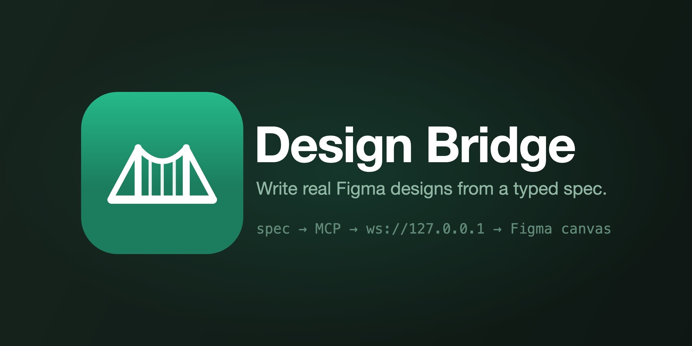

<p align="center">
  
</p>

# Design Bridge

An MCP server that lets an AI agent (Claude Code, or any MCP client) write real
designs onto a Figma canvas — auto-layout frames, live text, color variables —
from a small typed spec.

Figma's REST API cannot create design nodes; only Plugin API code running
*inside* Figma can. So Design Bridge is three pieces: an MCP server the agent
talks to, a local WebSocket, and a Figma plugin that does the actual building.

```
agent → MCP server → ws://127.0.0.1:3055 → plugin UI iframe → plugin sandbox → canvas
```

## Setup

You need two halves running: the server (once) and the plugin (per Figma file).

**1. Register the server with your MCP client**

No clone required — run it straight from npm:

```bash
claude mcp add figma-bridge -- npx -y figma-design-bridge
claude mcp list   # should show figma-bridge
```

<details>
<summary>Or run from a clone</summary>

```bash
git clone https://github.com/evidence-codes/figma-design-bridge
cd figma-design-bridge
npm install
claude mcp add figma-bridge -- node "$(pwd)/src/server.js"
```
</details>

**2. Load the plugin in Figma**

- **From Figma Community:** *(link once published)* — click Install, then run it
  from `Plugins → Design Bridge`.
- **From source:** Figma desktop → open a Design file → right-click the canvas →
  `Plugins → Development → Import plugin from manifest…` → pick
  `plugin/manifest.json`, then run `Plugins → Development → Design Bridge`.

A small panel appears with a green dot when it finds the server. **Leave that
panel open** — closing it kills the socket.

**3. Check the wiring**

Ask your agent to call `figma_status`. You should get back your file and page
name.

## Tools

| Tool | Does |
|---|---|
| `figma_status` | Connection check. Start here when something's wrong. |
| `render_screen` | Builds a screen from a spec. Same `key` replaces in place. |
| `create_variables` | Creates a colour variable collection. |
| `list_screens` | Everything this bridge has rendered, with keys. |
| `delete_screen` | Removes one by key. |

## Smoke test

Paste this to your agent once everything's connected:

> Use render_screen with this spec:
> ```json
> {
>   "key": "smoke-test",
>   "name": "Smoke test",
>   "width": 600,
>   "background": "#FBFBF9",
>   "root": {
>     "type": "frame", "layout": "col", "gap": 16, "pad": 32, "width": "fill",
>     "children": [
>       { "type": "text", "content": "Extracted scope",
>         "font": "Inter", "weight": "Semi Bold", "size": 24, "color": "#14201C" },
>       { "type": "frame", "layout": "row", "gap": 12, "pad": [12, 16],
>         "fill": "#E7F0EB", "radius": 8, "width": "fill",
>         "children": [
>           { "type": "text", "content": "Stated", "font": "Inter",
>             "weight": "Medium", "size": 12, "color": "#1F5F45" },
>           { "type": "text", "content": "Five-page marketing site",
>             "font": "Inter", "size": 14, "color": "#14201C" }
>         ] }
>     ]
>   }
> }
> ```

A frame should appear on your canvas with real auto layout. Run it twice — the
second run replaces the first rather than stacking a duplicate.

## The IR

`src/schema.js` is the contract. Three node types:

- **frame** — the only container. `layout` (`row`/`col`/`none`), `gap`, `pad`,
  `align`, `justify`, `fill`, `stroke`, `radius`, `width` (`hug`/`fill`/`fixed`).
- **text** — `content`, `font`, `weight`, `size`, `lineHeight`, `color`.
- **rect** — `w`, `h`, `fill`, `stroke`, `radius`.

Everything maps one-to-one onto a Figma concept. That's deliberate: no CSS to
reverse-engineer, no layout engine, no guessing what a `div` was supposed to be.
Keep it small — every field you add is a field the plugin must handle and the
model must learn.

## Configuration

The server listens on `127.0.0.1:3055`. To change it, set `FIGMA_BRIDGE_PORT`
before launching **and** type the same port into the plugin panel's **Port**
field — both halves must agree.

## Things that will bite

**Fonts must exist in Figma.** The plugin loads every font in a spec before
building. If Figma doesn't have it, the render fails with a clear message rather
than silently substituting. `weight` is Figma's style name — `"Regular"`,
`"Medium"`, `"Semi Bold"` — not a CSS number.

**`width: "fill"` needs an auto-layout parent.** Inside a `layout: "none"` frame
it's ignored. This fails soft rather than throwing, so a screen that looks
subtly wrong is usually this.

**One socket at a time.** A second Figma window connecting drops the first. If
renders start going to the wrong file, that's why.

**Keys are how you iterate.** Re-rendering `"review-screen"` replaces it. Change
the key and you get a second copy — useful for comparing variants, annoying by
accident.

## What's not here

Components and variants (`figma.createComponent`, `combineAsVariants`), binding
variables to node properties rather than just creating them, images, and
multi-page targeting. Those are where this stops being a toy — contributions
welcome.

[`cursor-talk-to-figma-mcp`](https://github.com/sonnylazuardi/cursor-talk-to-figma-mcp)
is an open-source implementation of the same architecture that goes considerably
further. Design Bridge trades breadth for a small, strict IR: one spec renders a
whole screen, every field maps to exactly one Figma concept, and there's no
layout engine to fight.

## License

MIT — see [LICENSE](LICENSE).
